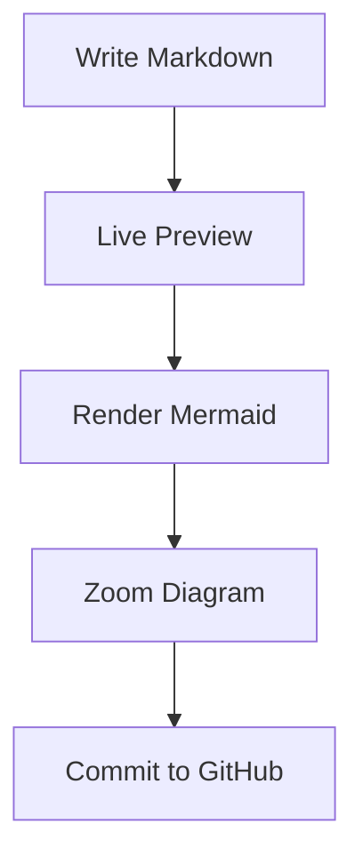

# Polarbear

## Project Name

```text
Polarbear
```

## 中文名称

```text
北极熊
```

## Main Slogan

```text
Polarbear — A local-first Markdown editor for writers, developers, and GitHub-based knowledge workflows.
```

## 中文 Slogan

```text
北极熊 Polarbear —— 一个本地优先、面向开发者的 Markdown 编辑与 GitHub 知识管理工具。
```

## Short Description

```text
Polarbear is an open-source, local-first Markdown editor built with Rust, Tauri, and TypeScript. It focuses on clean writing, live preview, Mermaid diagrams, plugin-based extensibility, and GitHub-powered document workflows.
```

## 中文简介

```text
Polarbear 是一个使用 Rust、Tauri 和 TypeScript 构建的开源、本地优先 Markdown 编辑器。它专注于清爽写作、实时预览、Mermaid 图表、插件化扩展，以及基于 GitHub 的文档工作流。
```

> A local-first Markdown editor for writers, developers, and GitHub-based knowledge workflows.

Polarbear is an open-source, local-first Markdown editor built with Rust, Tauri, and TypeScript.  
It focuses on clean writing, live preview, Mermaid diagrams, plugin-based extensibility, and GitHub-powered document workflows.

中文名称：**北极熊**

MVP platform targets:

- macOS desktop app
- iOS app, experimental but structurally supported from the beginning

---

## Why Polarbear?

Polarbear is designed for people who write technical documents, engineering notes, product specs, architecture diagrams, and GitHub-based knowledge bases.

It is not just another Markdown editor.  
It aims to become a local-first writing workspace with:

- Fast native experience powered by Rust and Tauri
- Clean Markdown editing and live preview
- First-class Mermaid diagram support
- Zoomable diagram viewer
- GitHub repository integration
- Plugin-based extensibility
- Clear architecture for long-term open-source maintenance

Write locally. Preview clearly. Sync with GitHub.

Polarbear is not designed as a macOS-only app. The MVP targets macOS and iOS first, using Tauri v2 with mobile compatibility in mind. Platform-specific behavior must stay behind traits or adapter modules so the Rust core remains portable.

---

## Features

### Markdown Editing

- Open local Markdown files
- Edit Markdown with a clean editor
- Live preview
- Split view: editor and preview side by side
- Preview-only mode
- Editor-only mode
- Unsaved change indicator
- Local file access designed with desktop permissions and iOS sandbox limitations in mind

### Mermaid Diagram Support

- Render Mermaid code blocks inside Markdown preview
- Open Mermaid diagrams in a zoomable viewer
- Zoom in, zoom out, reset zoom
- Drag and pan large diagrams
- Copy Mermaid source
- Export SVG
- Reserve export PNG capability for future versions
- Keep Mermaid rendering in the WebView layer for macOS and iOS compatibility

### GitHub Workflow

- Connect to a GitHub repository
- Browse Markdown files from a repository
- Read remote Markdown files
- Edit and commit changes back to GitHub
- Sync through the GitHub REST API so the workflow can run on both macOS and iOS
- Use commit messages such as:

```text
docs: update {file_path}
```

### Plugin System

Polarbear uses a plugin-oriented architecture from the beginning.

Built-in plugins:

- `markdown-preview`
- `mermaid-renderer`
- `github-sync`

Initial plugin capabilities:

- `MarkdownRenderer`
- `DiagramRenderer`
- `RepositorySync`
- `Exporter`

The first version uses built-in plugins and metadata-based plugin management.
Dynamic third-party plugin loading will be considered after the security model is mature.

The MVP plugin model does not rely on dynamic native library loading because that is not iOS-friendly.

---

## Tech Stack

- Rust
- Tauri v2 with mobile compatibility
- React
- TypeScript
- Vite
- CodeMirror 6
- Mermaid
- GitHub REST API

---

## Project Structure

```text
polarbear/
  Cargo.toml
  README.md
  ARCHITECTURE.md
  CONTRIBUTING.md
  LICENSE
  crates/
    polarbear-core/
    polarbear-tauri/
  apps/
    desktop/
      package.json
      src/
      src-tauri/
        Cargo.toml
```

The `apps/desktop` package is the first application shell. Its `src-tauri` crate is the native Tauri app entry point, while shared UI and core architecture must remain suitable for an iOS Tauri target.

---

## Architecture Principles

Polarbear follows these principles:

- Local-first by default
- Rust core, TypeScript UI
- macOS and iOS first
- Clear module boundaries
- Plugin-oriented design
- No business logic inside Tauri commands
- Domain models separated from DTOs
- Testable core logic
- Explicit error handling
- No token leakage in logs
- Platform-specific logic behind traits or adapter modules
- No macOS-only APIs inside `polarbear-core`
- Small, meaningful modules
- Descriptive naming

---

## Platform Support

Polarbear targets macOS and iOS first.

MVP targets:

- macOS desktop app
- iOS app, experimental but structurally supported

Future targets:

- Windows
- Linux
- Android

Platform rules:

- Use Tauri v2 and keep mobile compatibility in mind.
- Keep UI responsive across desktop and mobile screen sizes.
- Do not rely on macOS-only APIs directly inside `polarbear-core`.
- Put platform-specific behavior behind traits or adapter modules.
- Keep Tauri commands thin and free of platform-specific business logic.
- Use GitHub REST API for sync so it can work on iOS.
- Treat local file access as capability-based because iOS runs inside an app sandbox.
- Keep Mermaid rendering in the WebView layer.
- Avoid dynamic native plugin loading for the MVP.

---

## Rust Code Style

Rust code should follow idiomatic naming conventions:

- Types, traits, and enums use `UpperCamelCase`
- Functions, methods, variables, and modules use `snake_case`
- Constants use `SCREAMING_SNAKE_CASE`
- Avoid unclear names such as `handle`, `process`, `data`, `info`, `manager`
- Prefer meaningful names such as:

  - `GitHubSyncService`
  - `MarkdownDocument`
  - `PluginRegistry`
  - `SecretStore`
  - `MermaidRendererPlugin`

Do not use `unwrap()` or `expect()` in production code.
Use explicit error types and return meaningful errors.

---

## Development

### Prerequisites

- Rust stable
- Node.js LTS
- pnpm or npm
- Tauri v2 prerequisites for macOS and iOS
- Xcode for iOS development

### Install Dependencies

```bash
npm install
```

This installs frontend workspace dependencies. Rust dependencies are resolved by Cargo when you run Rust commands.

### Run Shared Frontend Scaffold

```bash
npm run build
```

The current scaffold writes a static app preview bundle to:

```text
apps/desktop/dist/
```

### Run macOS App

```bash
npm run tauri -- dev
```

This starts the Tauri macOS app in development mode after the Tauri package is fully wired.

You can also run the workspace script directly:

```bash
npm --workspace apps/desktop run tauri:dev
```

### Run iOS App

```bash
npm run tauri -- ios dev
```

This starts the experimental iOS target after Tauri mobile setup is complete and Xcode is configured.

### Run Rust Binary

```bash
cargo run -p polarbear-tauri --bin polarbear
```

This runs the current Rust binary entry point for Polarbear.

### Build Rust Workspace

```bash
cargo build --workspace
```

### Build Release Binary

```bash
cargo build --workspace --release
```

The release binary is generated under:

```text
target/release/
```

### Build Shared Frontend

```bash
npm run build
```

The frontend bundle is generated under:

```text
apps/desktop/dist/
```

### Package macOS App

```bash
npm run tauri -- build
```

This creates native macOS packages through Tauri after the app shell is fully wired.

Expected package outputs are generated under the Tauri target directory, commonly:

```text
apps/desktop/src-tauri/target/release/bundle/
```

For macOS, expected artifacts may include `.app` and `.dmg` packages depending on the Tauri bundler configuration.

### Build iOS App

```bash
npm run tauri -- ios build
```

This builds the experimental iOS app after Tauri mobile setup is complete. The iOS target should share Rust core capabilities and WebView UI behavior with the macOS app.

### Install Locally

For development, run the app directly:

```bash
npm run tauri -- dev
```

For local installation on macOS after packaging:

1. Build the app with `npm run tauri -- build`.
2. Open the generated `.dmg` or `.app` from the bundle output directory.
3. Move `Polarbear.app` to `/Applications`.

### Mobile Notes

iOS support requires Tauri mobile setup and Xcode. The app must account for iOS sandboxed file access, iOS Keychain-backed secrets, responsive layouts, and WebView-based Mermaid rendering.

### Run Rust Checks

```bash
cargo fmt
cargo clippy --all-targets --all-features -- -D warnings
cargo test --all
```

### Run Frontend Checks

```bash
npm run lint
npm run typecheck
npm run build
```

---

## GitHub Token

Polarbear uses a GitHub token to read and update Markdown files in a repository.

Security rules:

- Do not store tokens in plain text configuration files
- Do not print tokens in logs
- Token access must go through the `SecretStore` abstraction
- macOS should use Keychain in the future
- iOS should use Keychain in the future
- `polarbear-core` should depend on the `SecretStore` trait, not platform keychain APIs directly
- The first MVP may use an in-memory implementation with a clear TODO

---

## Mermaid Example



---

## Roadmap

### MVP

- Local Markdown open and save
- Markdown live preview
- Mermaid rendering
- Mermaid zoom viewer
- Built-in plugin registry
- GitHub settings page
- GitHub file read and update skeleton
- macOS desktop app
- Experimental iOS app structure

### Next

- GitHub branch switcher
- Local Git repository support
- Markdown search
- Document outline
- Export PDF
- Export HTML
- Export PNG for diagrams
- More plugin capabilities

### Future

- AI-assisted writing
- GitHub Pull Request editing
- Team knowledge base mode
- Document publishing
- Custom plugin marketplace

---

## License

MIT or Apache-2.0.
Please keep the license decision explicit before publishing the first release.

npm --workspace apps/desktop run tauri -- dev

npm --workspace apps/desktop run typecheck
npm --workspace apps/desktop run build
cargo test --workspace
cargo build --workspace


---
npm --workspace apps/desktop run tauri -- build --bundles dmg

cd apps/desktop
npm run tauri -- build --bundles dmg

npm run tauri build -- --bundles dmg

npm --workspace apps/desktop run tauri -- build

npm --workspace apps/desktop run tauri -- icon ./app-icon.svg


npm install
npm --workspace apps/desktop run typecheck
npm --workspace apps/desktop run tauri -- build --bundles dmg
---