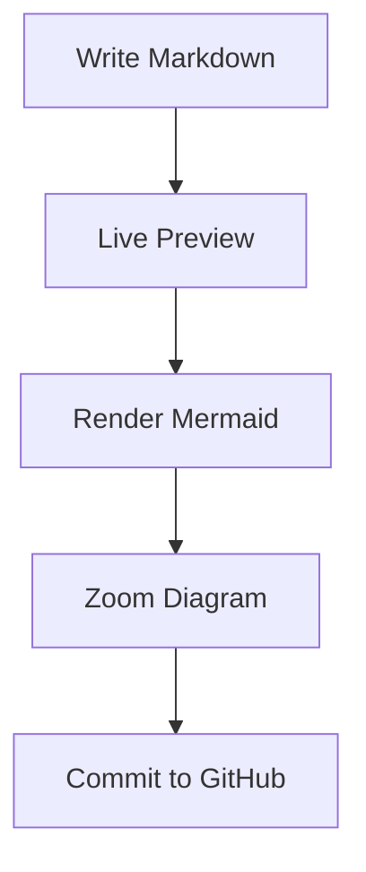

# Polarbear

[English](README.md) | [简体中文](README-zh.md)

> A local-first Markdown editor for writers, developers, and GitHub-based knowledge workflows.

Polarbear is an open-source, local-first Markdown editor built with Rust, Tauri, and TypeScript.  
It focuses on clean writing, live preview, Mermaid and PlantUML diagrams, and GitHub/GitLab document workflows.

Current platform status:

- macOS desktop app: supported and built by CI
- Windows desktop app: packaged by the release workflow
- iOS: planned, but the Tauri iOS project has not been initialized in this repository

---

## Why Polarbear?

Polarbear is designed for people who write technical documents, engineering notes, product specs, architecture diagrams, and GitHub-based knowledge bases.

It is not just another Markdown editor.  
It aims to become a local-first writing workspace with:

- Fast native experience powered by Rust and Tauri
- Clean Markdown editing and live preview
- First-class Mermaid diagram support
- Zoomable diagram viewer
- GitHub and GitLab Cloud Sync
- Clear architecture for long-term open-source maintenance

Write locally. Preview clearly. Sync when needed.

Polarbear is not intended to remain macOS-only. The current product is a desktop application; mobile support remains a design constraint, not a runnable target in this checkout. Platform-specific behavior must stay behind traits or adapter modules so portable code remains reusable.

---

## Features

### Markdown Editing

- Open local Markdown files
- Edit Markdown with a clean editor
- Live preview
- Split view: editor and preview side by side
- Preview-only mode
- Editor-only mode
- Unsaved change indicator
- Local file access designed with desktop permissions and iOS sandbox limitations in mind

### Diagram Support

- Render Mermaid code blocks inside Markdown preview
- Open Mermaid diagrams in a zoomable viewer
- Zoom in, zoom out, reset zoom
- Drag and pan large diagrams
- Copy Mermaid source
- Export SVG
- Export Mermaid and PlantUML diagrams as SVG or PNG
- Keep Mermaid rendering in the WebView layer so it remains portable to a future iOS target

### Cloud Sync

- Connect to a GitHub or GitLab repository
- Browse Markdown files from a repository
- Read remote Markdown files
- Edit and commit changes back to the selected provider
- Sync through provider REST APIs without requiring a local Git installation
- Use commit messages such as:

```text
docs: update {file_path}
```

### Extensibility

Mermaid, PlantUML, Cloud Sync, and export are built-in features with explicit module boundaries. Polarbear does not currently expose a runtime plugin API. A plugin system will only be considered after permissions, versioned contracts, and sandboxing are designed.

---

## Tech Stack

- Rust
- Tauri v2 with mobile compatibility
- React
- TypeScript
- Vite
- CodeMirror 6
- Mermaid
- GitHub and GitLab REST APIs

---

## Project Structure

```text
polarbear/
  Cargo.toml
  Cargo.lock
  package.json
  package-lock.json
  README.md
  README-zh.md
  ARCHITECTURE.md
  apps/
    desktop/
      package.json
      src/
        app/
        commands/
        features/
        shared/
      src-tauri/
        Cargo.toml
```

The `apps/desktop` package contains the React application. Its `src-tauri` directory is the only Rust application crate and the native Tauri entry point. The repository does not currently contain separate `CONTRIBUTING.md` or license-text files; license metadata is declared as `MIT OR Apache-2.0` in Cargo manifests.

---

## Architecture Principles

Polarbear follows these principles:

- Local-first by default
- Feature-oriented TypeScript UI with a typed Tauri boundary
- Desktop-first delivery with portable feature boundaries
- Clear module boundaries
- Built-in feature modules with explicit ownership
- Thin Tauri command entry points backed by focused Rust services
- Domain models separated from DTOs
- Testable core logic
- Explicit error handling
- No token leakage in logs
- Platform-specific logic behind traits or adapter modules
- macOS-only APIs isolated in platform modules
- Small, meaningful modules
- Descriptive naming

---

## Platform Support

Polarbear currently ships as a desktop application.

Supported release targets:

- macOS
- Windows

Planned target:

- iOS, after the Tauri iOS project is initialized and native capabilities are audited

Future targets:

- Linux
- Android

Platform rules:

- Use Tauri v2 and keep mobile compatibility in mind.
- Keep UI responsive across desktop and mobile screen sizes.
- Keep macOS-only APIs isolated from portable command and service logic.
- Put platform-specific behavior behind traits or adapter modules.
- Keep Tauri commands thin and free of platform-specific business logic.
- Use provider REST APIs for sync so repository workflows do not depend on a local Git executable.
- Treat local file access as capability-based because a future iOS target will run inside an app sandbox.
- Keep Mermaid rendering in the WebView layer.
- Avoid dynamic native plugin loading for the MVP.

---

## Rust Code Style

Rust code should follow idiomatic naming conventions:

- Types, traits, and enums use `UpperCamelCase`
- Functions, methods, variables, and modules use `snake_case`
- Constants use `SCREAMING_SNAKE_CASE`
- Avoid unclear names such as `handle`, `process`, `data`, `info`, `manager`
- Prefer meaningful names such as:

  - `CloudSyncStore`
  - `RepositorySettings`
  - `SecretStoreError`
  - `WorkspaceFile`

Do not use `unwrap()` or `expect()` in production code.
Use explicit error types and return meaningful errors.

---

## Development

### Prerequisites

- Rust stable
- Node.js LTS
- npm (the committed lockfile is `package-lock.json`)
- Tauri v2 prerequisites for the platform being built
- Xcode Command Line Tools for macOS development

### Install Dependencies

For a clean checkout, install the exact versions from the committed lockfile:

```bash
npm ci
```

Use `npm install` only when intentionally updating dependencies and the lockfile. Rust dependencies are resolved by Cargo when a Rust or Tauri command runs.

### Run macOS App

```bash
npm run tauri:dev
```

This starts Vite on `127.0.0.1:1420`, compiles the Rust crate, and opens the Tauri desktop app.

You can also run the workspace script directly:

```bash
npm --workspace apps/desktop run tauri -- dev
```

The `tauri:dev` alias is defined at the repository root. There is no script with that name inside `apps/desktop/package.json`; the direct workspace form must use `run tauri -- dev` as shown above.

### iOS Status

The iOS icons exist, but this checkout does not contain Tauri's generated `gen/apple` project. Therefore `npm run tauri -- ios dev` and `npm run tauri -- ios build` are not currently runnable workflows. Initializing iOS requires an explicit platform setup pass with Xcode, `npm run tauri -- ios init`, and an audit of native capabilities before these commands can be documented as supported.

### Build Rust Workspace

```bash
cargo build --workspace
```

### Build Release Binary

```bash
cargo build --workspace --release
```

The release binary is generated under:

```text
target/release/
```

### Build Shared Frontend

```bash
npm run build
```

The frontend bundle is generated under:

```text
apps/desktop/dist/
```

### Package macOS App

```bash
npm run tauri:build
```

This creates the configured native packages through Tauri.

Expected package outputs are generated under the Tauri target directory, commonly:

```text
target/release/bundle/
```

For macOS, expected artifacts may include `.app` and `.dmg` packages depending on the Tauri bundler configuration.

### Install Locally

For development, run the app directly:

```bash
npm run tauri:dev
```

For local installation on macOS after packaging:

1. Build the app with `npm run tauri:build`.
2. Open the generated `.dmg` or `.app` from the bundle output directory.
3. Move `Polarbear.app` to `/Applications`.

### Mobile Notes

Future iOS support requires Tauri mobile initialization and Xcode. It must account for sandboxed file access, Keychain-backed secrets, responsive layouts, and WebView-based Mermaid rendering. Do not treat the presence of iOS icon files as proof that the target is initialized.

### Run Rust Checks

```bash
cargo fmt --all -- --check
cargo clippy --workspace --all-targets --all-features -- -D warnings
cargo test --workspace
```

### Run Frontend Checks

```bash
npm run lint
npm run typecheck
npm test
npm run build
```

---

## Cloud Sync Token

Polarbear uses a GitHub or GitLab personal access token to synchronize workspace files.

Security rules:

- Do not store tokens in plain text configuration files
- Do not print tokens in logs
- Token access must go through the Rust `secret_store` module
- Release builds require the platform Keychain
- Plaintext fallback storage is limited to debug builds

---

## Mermaid Example


```mermaid
graph TD
    A[Write Markdown] --> B[Live Preview]
    B --> C[Render Mermaid]
    C --> D[Zoom Diagram]
    D --> E[Commit to GitHub]
```

---

## Roadmap

### Current gaps

- Initialize and validate the iOS target before advertising mobile development commands
- Export complete documents to PDF and HTML
- Continue extracting workspace, repository sync, and export services from the large Tauri entry point
- Expand integration coverage around native commands and release packaging

### Future

- AI-assisted writing
- GitHub Pull Request editing
- Team knowledge base mode
- Document publishing
- Custom plugin marketplace

---

## License

Cargo manifests currently declare `MIT OR Apache-2.0`. The repository still needs the corresponding license-text files before distribution.
