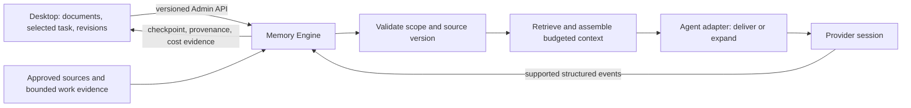

# Desktop-led memory and context design

Status: M1 technical slice and validation assets implemented. The [automated M1 report](desktop-memory-m1-automated-report.md) records development **PASS**, held-out **FAIL**, and a **REVISE** decision; product rollout remains blocked, the human pilot remains unrun, and M2 remains proposed.

Date: 2026-09-19.

M1 refinement: [Reliable next-day reuse validation plan](desktop-memory-m1-validation-plan.md) owns the first milestone's acceptance rules. It narrows initial work to durable capture, accurate retrieval, exact evidence, and safe applicability; runtime/checkpoint and token experiments follow only after that gate.

Inspected baseline: Polarbear Desktop `a217f82`; Polarbear Memory `0c0e8c6` (`v0.3.12`). This proposal describes those local checkouts, not every released provider capability.

## 1. Decision and success condition

Grow Memory into a source-linked context capability of Polarbear Desktop. Desktop owns authoring, task selection, evidence navigation, and review. Memory Engine owns durable state, validity, retrieval, and context assembly. Agent adapters own delivery to a particular runtime and report what they can actually observe.

The optimization objective is the total model cost of completing an accepted task, subject to unchanged correctness and permission boundaries. Stored record counts, retrieval hits, shorter packets, and smaller parent-agent contexts are diagnostics; none alone proves token savings.

Memory earns its place when it replaces work: reconstructing a decision, rediscovering a file, repeating a failed approach, reading an unchanged document again, or carrying obsolete conversation history. If it merely adds text to those activities, it can increase cost.

Three mechanisms must be evaluated separately:

1. Avoid repeated investigation with concise, applicable knowledge and exact source pointers.
2. Avoid repeated delivery with session-aware, versioned context manifests.
3. Replace old conversation history with a sufficient checkpoint at a safe, supported session boundary.

A shorter packet does not delete existing provider history. Prompt caching may reduce billed cost while leaving logical context size unchanged. Both quantities need separate accounting.

## 2. What the inspected implementation already provides

The current Engine is not just a database dump. It already has FTS, entity and relation retrieval, validity dates, evidence, revisions, tasks, checkpoints, bounded packets, delivery receipts, lifecycle adapters, migrations, and backups. Preserve this infrastructure and narrow the product model exposed above it.

| Observed behavior | Why it matters | Baseline evidence |
|---|---|---|
| Desktop Context receives the workspace root, but no active file, selection, or revision | Editing activity cannot currently guide Memory retrieval | Desktop `apps/desktop/src/features/memory/context/ContextWorkspace.tsx:17`, `apps/desktop/src/App.tsx:4003` |
| Desktop loads 100 memories and filters that subset locally | Search can miss older records even when Engine has them | Desktop `useContextOsSession.ts:70`, `ContextWorkspace.tsx:220` under the Context feature |
| Evidence paths and relation IDs are rendered as text | Users cannot easily verify or maintain recalled knowledge in its original document | Desktop `ContextWorkspace.tsx:321` |
| Planner unconditionally combines search results with recent records; inventory size increases automatic budget | Growing the collection can grow injected context without proving relevance | Engine `src/application/context-planner.ts:22`, `:117`, `:129` |
| Decisions and constraints get mandatory priority by kind; only task scope is filtered | Importance is being used as a substitute for applicability | Engine `src/application/context-planner.ts:50`, `:230` |
| Existing-session gateway turns and CLI resume can receive a complete packet again | Old history and repeated Memory can accumulate together | Engine `src/adapters/codex/app-server-gateway.ts:97`, `src/runtime/session-manager.ts:52` |
| Content deduplication ignores scope; task-state supersession uses project and branch | Concurrent tasks can share the wrong record or supersede each other's state | Engine `src/storage/knowledge-command-service.ts:36`, `:50` |
| Checkpoints append old state, and session observation reads select the earliest bounded history | Large sessions can retain obsolete information and miss recent recovery details | Engine `src/application/checkpoint-builder.ts:11`, `src/storage/context-telemetry-repository.ts:86` |
| Session replacement readiness is currently the existence of a checkpoint | Presence alone does not prove that recent work is recoverable | Engine `src/protocol-local/admin-router.ts:586` |
| Savings compare assembled content against candidate text or fixture history | The current figures do not establish actual task-level savings | Engine `src/application/context.ts:124`, `src/application/benchmark.ts:337` |

Desktop has a Markdown editor, document revisions, optimistic save checks, navigation, Memory editing/history, and an authenticated Admin API bridge. It does not currently have a general agent conversation/execution host. Its file-change hooks poll visible/current document state; they are not a complete background workspace indexer.

The existing Memory activation proposal remains the preceding design context. This proposal makes that direction concrete around Desktop sources, smaller public concepts, session delivery, and real cost evaluation; it does not establish a competing storage system.

## 3. User workflow and system boundaries

The primary workflow should be: open a project, choose or resume a task, work in documents or an integrated agent, and return later with the minimum useful state restored. Memory administration remains an inspector, not the required daily workflow.



Desktop provides an ephemeral work descriptor containing project ID, explicit task ID, canonical worktree identity, branch/revision when available, active relative path, heading or selection range, and dirty-buffer status. Active files are ranking hints, not proof of user intent or applicability. Unsaved text may be used transiently for an explicit request, but is not silently promoted into durable truth.

Memory Engine remains the only owner of `memory.db`. Source reads stay inside authorized workspace boundaries and reject escaping paths and symlinks. Desktop uses its existing file-opening adapter for navigation and the Engine API for Memory mutations.

Use existing external-agent integrations first. A Desktop-managed execution host is a later product increment, not an assumed current capability. Starting with a source/context panel does not require implementing another chat client.

Initial supported scope is local Git projects using the current Unix transport. Non-Git folders and Windows Memory transport require explicit workspace-identity and transport work; the current Desktop packaging matrix does not make those Engine features available.

## 4. Four public concepts, not another schema expansion

Expose four concepts to Desktop and agents. These are application views over existing storage, not a requirement to replace all current tables with four tables.

| Concept | Responsibility | Existing foundation |
|---|---|---|
| Source | Locate an approved document section, code symbol, verified result, or explicit decision at a known revision | Evidence, anchors, episodes, repository files |
| Knowledge card | One reusable conclusion with applicability and supporting evidence | Knowledge units, versions, evidence links |
| Task checkpoint | The current minimum state needed to resume one task | Tasks and checkpoints |
| Context manifest | The versions and representations selected and delivered for one runtime context | Packets, items, delivery receipts |

Do not turn every message, tool result, document paragraph, or task update into a durable card. Searchable source sections can remain derived index entries without becoming asserted knowledge.

### 4.1 Knowledge identity and content

Give each card a stable UUID and revisions. Use an explicit topic/key plus normalized task/project ownership to resolve semantic duplicates; a content hash identifies an exact revision, not the meaning of a card. Branch/worktree/path/source compatibility belongs to separately revisioned applicability, not identity. Cross-owner identical text must not be silently merged. Semantic similarity proposes a merge; it does not authorize one. Cross-project global sharing is outside M1.

An illustrative card, not a finalized API schema:

```yaml
id: 05bc5f49-b6de-4db1-a59a-8f8ff347c9bb
revision: 3
owner:
  projectId: example-project
  kind: project
applicability:
  module: settlement
  branchPolicy: compatible-source-revision
topicKey: settlement.failed-state-retry
kind: decision
answer: A FAILED settlement must not be retried automatically.
appliesWhen: Changing reconciliation or retry behavior for this state machine.
reason: An earlier retry path could submit the settlement twice.
sources:
  - relativePath: docs/settlement.md
    headingPath: [State machine, FAILED]
    sourceRevision: sha256:example
    sectionDigest: sha256:example-section
verification: source-backed
freshness: current
```

Store source locator, source revision, and applicable conditions with the conclusion. Search aliases, related questions, embeddings, and snippets are rebuildable projections. A small set of type labels can help presentation; new business concepts should not require new tables or public enum variants by default.

Separate verification from freshness. An unchanged source does not make a model inference true; a changed file does not automatically refute a historical decision. Represent proposed, source-backed, and explicitly verified assertions separately from current, needs-review, superseded, and historical applicability.

Task progress belongs to a checkpoint keyed by task and worktree. Keep legacy `TASK_STATE` and `TODO` APIs compatible, but move new task-state writes to that authority rather than maintaining a second, project-wide task singleton in Knowledge.

### 4.2 Sources and one authority per fact

For document-backed cards, the approved document revision is authoritative. The card is a compact, source-linked representation. Desktop edits the document normally and Engine updates the derived representation after validation.

For explicit durable decisions without a document, the Engine card is authoritative and Desktop edits it through revision-checked API calls. Markdown export is a projection. Publishing a card into a document is an explicit promotion with provenance; it must not create two editable authorities that synchronize silently.

Enforce authority in Engine write APIs for every Desktop, CLI, and MCP caller. Newly document-backed cards reject generic direct assertion edits; a changed underlying decision goes through the source editor, while a mistaken interpretation may be corrected through explicit source-grounded review against the same source revision. Independent review annotations remain possible. Do not silently reclassify legacy manually editable cards. Promotion checks both expected revisions and either transfers authority explicitly or labels the document as a non-authoritative export. Since file and database writes are not one transaction, use a recoverable, idempotent promotion operation and switch authority only after the document write is confirmed.

Prefer heading paths plus section digests and approximate ranges over line numbers alone. Renames can preserve identity if content/repository evidence supports the match. Ambiguous anchors enter review instead of silently attaching to another paragraph.

If historical content is needed, retain an allowed bounded excerpt or an immutable repository revision reference. A digest alone cannot reconstruct the original evidence. Missing evidence must produce an honest unavailable/historical result, not an invented citation.

## 5. Capture and indexing

### 5.1 Capture at useful boundaries

Use three initial entry points:

1. In Desktop, selecting a passage and choosing to use it as a decision, rule, or reusable note creates a source-linked candidate.
2. Saved documents in an approved source set are parsed into section-level search entries. Saving alone does not mark every statement as verified or promote every section to a card.
3. Supported agent events provide bounded changes, command/test outcomes, and explicit proposed conclusions. Desktop does not already produce all these events; their adapters must report actual capability.

Automatic indexing can be deterministic and local. An optional model extractor should run once per meaningful source revision or checkpoint, with a write budget and idempotency key. Remote extraction or embedding requires an explicitly configured provider and approved data flow. Default behavior must not introduce network access.

Persist no raw prompts, complete chats, secrets, or full terminal logs in the Memory store. A deliberately saved, redacted task objective is distinct from retaining the user's entire prompt. Treat recalled source content as data with provenance, never as elevated instructions or authority to execute commands.

Admission criteria for a durable card: it has a future use condition, a concise claim, adequate provenance, and either likely reuse or high consequence if forgotten. Otherwise keep it as transient task state or a searchable source. Low-use historical decisions remain stored; non-selection is not deletion.

### 5.2 Incremental, replaceable indexes

Use the existing SQLite/FTS infrastructure first. Index document title, heading ancestry, path/symbol, scoped topic, aliases, short claim, and the source section. Include enough surrounding identity to avoid isolated fragments such as "this must never run twice."

The document-save path emits an invalidation hint after a successful save. An Engine-owned indexing worker coalesces revisions and checks digests. For approved sources changed outside Desktop, add bounded reconciliation and revalidate selected sources before delivery; correctness must not depend on Desktop remaining open. Workspace-wide watching is new work.

Keep bulk indexing and model extraction off document-save, lifecycle-hook, and synchronous Admin request paths. Use bounded queued batches with progress, cancellation, retry limits, and index-version markers. A missing or rebuilding index should report partial availability and permit targeted source lookup; it must not turn every client startup into a full source scan. Preserve the existing local transport timeouts rather than hiding long work behind longer waits.

A source revision changes derived entries and marks dependent conclusions for review when their approved validation footprint changes, including governing context and declared prerequisites. Equal selected-paragraph text alone does not prove applicability. Whole-document validation is the conservative M1 fallback until a narrower dependency boundary is approved; measure unnecessary review rather than disguising it as correctness. Proven unrelated changes need not invalidate an approved narrow footprint. Source deletion removes it from current reuse, with historical provenance retained under the established retention rules.

FTS rank is only one signal. Add deterministic path/symbol matches, task scope, and source validity first. Test Chinese tokenization, Chinese/English paraphrases, short identifiers, and file names explicitly. Introduce an optional local multilingual embedding index only if measured retrieval misses justify it. Rank-fuse lexical and semantic candidates; neither vectors nor a knowledge graph establishes truth. Do not add graph infrastructure by default.

## 6. Demand-driven retrieval and bounded delivery

Apply these stages in order:

1. Resolve explicit task/worktree identity and required scope. Never choose another task solely because it is the only recent one when the user has selected a conflicting task.
2. Filter invalid, incompatible, unavailable, and superseded current assertions. Historical questions can request historical evidence explicitly.
3. Retrieve a bounded candidate set using the request, objective, active source hints, exact identifiers, and existing index.
4. Require a relevance threshold; deduplicate by topic and source revision. Global rules apply only when explicitly designated as such.
5. Remove versions already delivered and still valid in this runtime context. Reserve genuinely mandatory active constraints before ranking optional content.
6. Choose compact representations by expected avoided work per token, including risk and uncertainty. This is a policy heuristic to calibrate, not an observed causal savings metric.
7. Return an empty optional context when nothing qualifies. Do not fill unused budget with recent records.

Use three representations:

- A small catalog hit: title, use condition, revision, source pointer, and expansion cost estimate.
- A concise answer: the conclusion, critical qualifier, and source reference.
- A bounded evidence excerpt: fetched only when needed, at the cited or revalidated revision.

The agent should receive the concise answer directly when an extra retrieval round trip would cost more. A catalog is not automatically cheaper: repeated tool calls and output must be measured. Send relevant catalog hits, not the complete memory directory.

Proposed starting budgets for experiments: about 600-1,500 tokens for resume state and selected knowledge; 0-300 additional tokens for an unchanged continuing task; bounded 300-800-token evidence expansions. These are configurable hypotheses, not observed optima. Native provider instructions, the user's request, and tool schemas are outside these Memory-only targets but inside total usage accounting. Reserve mandatory content, and if it cannot fit, report the insufficiency and decline automatic rotation rather than truncating essential conditions.

Use provider tokenizers when available and report estimates otherwise. Keep a safety margin. Do not clip a condition or negation from a critical claim to satisfy an arbitrary limit. Select another valid representation or require source inspection.

### 6.1 Delivery state and provider capability

Track `(project, task, worktree, providerSession, contextEpoch, itemId, revision, representation)` in a delivery manifest. Record assembly, send/acceptance evidence, and failure separately. None proves comprehension or usefulness.

Suppress repeated delivery only when the adapter knows the context lineage is continuous. Start a new epoch on a fresh session, observed compaction/reset, task switch, or uncertain lineage. Rehydrate the essential state when continuity cannot be established. A transport receipt by itself is insufficient for permanent suppression.

An obsolete version already present in provider history cannot be recalled. Deliver an explicit short correction or supersession when necessary; do not silently omit the old card and assume the model forgot it.

| Integration | Credible guarantee | Limitation |
|---|---|---|
| Ordinary MCP-assisted client | Supplies bounded context if the agent invokes the tools | Does not control existing history or guarantee pre-turn retrieval |
| Supported lifecycle hooks | Can provide context at observed boundaries | Actual context retention/compaction may be only partly observable |
| Client launched through a managed gateway | Can add context before proxied requests and track local delivery | Injection into an existing thread still does not replace history |
| Explicit fresh-session resume | Starts from a checkpoint and selected context when the adapter supports it | Requires a complete safe boundary and preservation of original permissions |

Model new operations as incremental capabilities, provisionally `contexts.prepare` and `contexts.expand`, alongside existing checkpoint/record operations. `prepare` returns a packet/manifest, skipped reasons, epoch requirements, and budget status. `expand` accepts selected item IDs and a bounded budget, rechecks authorization and source revisions, and returns evidence with provenance. A compact agent-facing tool surface should be separate from the full Desktop Admin surface.

Retain existing APIs during migration. Change Engine canonical contracts first, then Desktop's vendored contracts, generated TypeScript, Rust allowlist, and capability negotiation. Final names and schemas belong to that contract change, not this narrative.

## 7. Checkpoints that can actually replace history

A checkpoint is a current materialized state, not a growing concatenation of all observations. It must include:

- The durable objective, acceptance criteria, scope, and constraints that materially affect continuation.
- Current completed work and exact source/worktree state, including uncommitted file digests when relevant.
- Outstanding work, the next concrete action, blockers, and significant failed approaches with their conditions.
- Latest verification result for each check, including the code/source revision it verified.
- Last consumed event watermark, pending operations, and any information deliberately omitted that must be fetched before proceeding.

Use replace/update/retract semantics keyed by state identity. A later test result replaces the current result for that check and revision; historical failures remain separate evidence. Consume observations after a watermark in bounded pages, including late/replayed events, rather than repeatedly taking the first 500 events in a session.

Keep recovery-critical fields intact before adding explanatory history. Summary-of-summary chains should be periodically rebuilt from authoritative current state and selected evidence so omissions do not accumulate indefinitely.

A checkpoint can mark a task ready for session replacement only after it is committed, covers the latest settled event boundary, resolves essential source references, has no running tool operation or unresolved approval, and can fit a sufficient resume context. The initial implementation waits for operations to settle; supporting durable background operations across rotation would require separate ownership and result-reconciliation contracts. This improves the current existence-only check.

Readiness is evaluated again immediately before resuming. Compare current HEAD, worktree identity, and dirty-file/section digests with the checkpoint, reconcile drift, and invalidate verification tied to obsolete code. If an essential assumption changed, rebuild the affected recovery state or require focused verification before treating it as current. A checkpoint that was ready yesterday is not automatically ready today.

Rotation occurs at a safe task/phase boundary when expected reduction in repeated history outweighs checkpoint creation, rehydration, cold-cache cost, and recovery risk. Do not rotate blindly every fixed number of turns. Preserve workspace, permissions, approval configuration, model selection, and pending user intent. Resume failures should not replay side-effecting work under the assumption that the previous attempt never executed.

## 8. Desktop product design

The main surface should answer four questions: What am I working on? What does this task need? Where did this knowledge come from? Can I resume safely?

1. Add a context panel beside the existing editor with applicable conclusions and source freshness. Use the current document/heading/selection to narrow retrieval.
2. Make each source open at the relevant document section or bounded evidence viewer. Recheck anchors on open, and display a revision mismatch when the original section is unavailable. Code/non-Markdown evidence may need a read-only viewer or existing authorized external-editor route; the Markdown editor is not already a general code IDE.
3. Replace local filtering of the first 100 records with Engine search and pagination. Expose no-hit and ambiguous-scope states clearly.
4. Show the active task's recovery state and one meaningful next action. Keep detailed entity/relation/audit records behind an inspector.
5. Wire the existing packet explanation API into a preview: included, skipped, why relevant, source revision, stale/conflicting status, token allocation, and delivery evidence.
6. Give users lightweight corrections: wrong for this task, source changed, supersedes an older conclusion, and retain this rule. A pin does not bypass project authorization, relevance scope, or invalidity.
7. Show measured usage and task outcomes separately from packet-size estimates. Missing usage displays unavailable, not zero or a positive savings badge.

Extract focused frontend document-context and source-navigation adapters. Keep new coordination out of the large `App.tsx` and Rust `main.rs`. Engine-owned search/freshness must continue to work for external-agent clients when Desktop is closed.

## 9. Prove net savings with accepted tasks

Normalize provider events before aggregation. Providers may report per-call, per-turn, or cumulative values, and may include/exclude cache tokens differently. Preserve original field semantics and observability status. Missing usage is unknown; process exit success is not task acceptance.

Count every model call in the evaluated workflow: initial context, repeated history, tool interactions, generation, extraction, model-based retrieval/reranking, checkpoint preparation, failed attempts, retries, and corrective work. Input token totals must not double-count cached tokens. Embedding workloads and local indexing time are reported separately when they are not generative-model tokens.

```text
net_token_savings = all_model_tokens(control) - all_model_tokens(treatment)

cohort_cost_per_accepted_task = total_cost_of_all_attempts / accepted_task_count

amortized_write_cost = explicitly_attributed_capture_and_index_cost / reuse_count
```

Also report uncached input, cache-read/write, output, price-weighted cost at recorded model rates, latency, and completion rate. Shared preprocessing cost must have a declared attribution window. Include cold and warm workloads; do not assume enough future reuse to hide an expensive write path.

For illustration only: if equivalent baseline work costs 20,000 total tokens and Memory-enabled work costs 12,000 foreground tokens plus 1,500 extraction/checkpoint tokens, net saving is 6,500. A 1,000-token packet injected into an otherwise unchanged 20,000-token workload instead costs at least 21,000 before any extraction or repeated-history effects. Neither is a measured Polarbear result.

Run four controlled arms:

| Arm | Purpose |
|---|---|
| A: native provider history, Memory disabled | Realistic baseline including native caching and compaction |
| B: native history plus current Memory | Detect whether today's extra injection helps or adds cost |
| C: fresh session plus task checkpoint | Isolate the benefit of replacing history |
| D: checkpoint plus proposed source-linked, demand-driven knowledge | Measure the incremental value of reusable knowledge |

Use identical starting repository state, task, model/version, tool permissions, and acceptance tests. Build memory only from information available before the evaluated request; do not seed hidden solution answers. Prevent cross-arm state contamination. Repeat stochastic runs, randomize order, and report paired distributions and uncertainty. Synthetic packet tests remain useful for regressions but cannot substitute for executing tasks.

Include continuation after interruption, repeated architectural questions, ambiguous parallel tasks, branch divergence, source edits/renames, obsolete decisions, paraphrases, Chinese/English requests, no relevant memory, conflicting evidence, long sessions, and adversarial source instructions. Checkpoint and source-validity invariants receive deterministic tests.

After M1, start with a 30-task engineering pilot and repeated runs, expanding until cost/quality uncertainty is informative. Predeclare workload classes and report simple edits, architecture lookup, recurring maintenance, long tasks, and cross-session continuation separately. The earlier 20% lower-cost goal is an ambition for suitable workloads, not a universal product gate. A savings claim requires positive measured net savings, no observed critical regression, and acceptance-rate non-inferiority within a predeclared margin (for example two percentage points). A small pilot may be inconclusive; do not publish a savings claim in that case or conceal unsuccessful workload classes in an aggregate.

Do not label reference-ID mentions, delivery counts, selection frequency, or self-reported agent usage as proven usefulness. They are weak signals to compare with task outcomes and repeated-read traces.

## 10. Incremental delivery and migration

| Increment | Deliverable | Exit evidence |
|---|---|---|
| 0. Define M1 truth | Freeze ownership/applicability oracle, source footprint, identity migration, and negative fixtures | Expected outcomes exist independently of retrieval code |
| 1. Validate Desktop sources (M1) | Source navigation, Engine search/paging, explicit passage-to-card capture, durable restart and mutation tests | Joint recall, wrong-reuse, exact-source, performance, and delayed-use gates pass |
| 2. Assemble only useful context | Relevance/validity gates, incremental source index, concise cards and evidence expansion, empty results, epoch-aware delivery | Irrelevant tasks receive no optional injection; unchanged known versions are not repeatedly appended |
| 3. Resume with bounded state | Sufficient checkpoints and supported fresh-session workflow; complete provenance and usage accounting | Interrupted tasks pass the same acceptance tests with measured total savings |
| 4. Add demonstrated retrieval improvements | Optional local multilingual embeddings or selective reranking | Additional retrieval accuracy offsets its latency, maintenance, and measured cost |

The first vertical slice is deliberately small: approved Markdown → reviewed card → close Desktop and Engine → restart → ask a related question → find the card → open exact evidence → change the source → require review rather than wrong reuse. Develop within one Git project, but verify with multiple tasks, projects, and worktrees. No provider runtime, checkpoint, rotation, or token experiment is required for M1. Normalize usage and establish the runtime control before later M2 experiments, not as an obstacle to proving this first slice.

Preserve existing databases, backups, migration rollback, and legacy APIs. Add scoped identities and source/version fields through tested migrations; do not reinterpret ambiguous historical task records automatically. Keep legacy histories inspectable, rebuild derived indexes, shadow-test the new selection policy, then enable it behind capabilities. Retire duplicate write paths only after callers migrate. Do not drop existing evidence or redesign every normalized table as the first step.

This proposal makes no production code changes, starts no agent sessions, invokes no paid model extraction, and authorizes no automatic cloud indexing. Implementation should select the first vertical slice and use the repository's normal contract, migration, test, and release gates.

## 11. External evidence and its limits

The implementation choices above are Polarbear-specific design recommendations, not experimentally established results for this project.

- Anthropic's [Effective context engineering for AI agents](https://www.anthropic.com/engineering/effective-context-engineering-for-ai-agents) describes just-in-time source access and structured notes alongside compaction. This supports separating stored information from the context needed now; it does not establish that any particular Polarbear budget saves tokens.
- Anthropic's [Contextual Retrieval](https://www.anthropic.com/engineering/contextual-retrieval) motivates preserving document context around indexed fragments and combining exact-match with semantic retrieval. Its benchmark percentages are not adopted as Polarbear targets or savings evidence.
- [LongMemEval](https://arxiv.org/abs/2410.10813) tests extraction, cross-session reasoning, temporal reasoning, updates, and abstention. These inform the failure scenarios above; the benchmark is not a direct measurement of coding-task token savings.

Local design context: Memory `docs/en/planning/memory-activation-proposal.md`, Desktop `ARCHITECTURE.md`, and the source locations listed in section 2.
